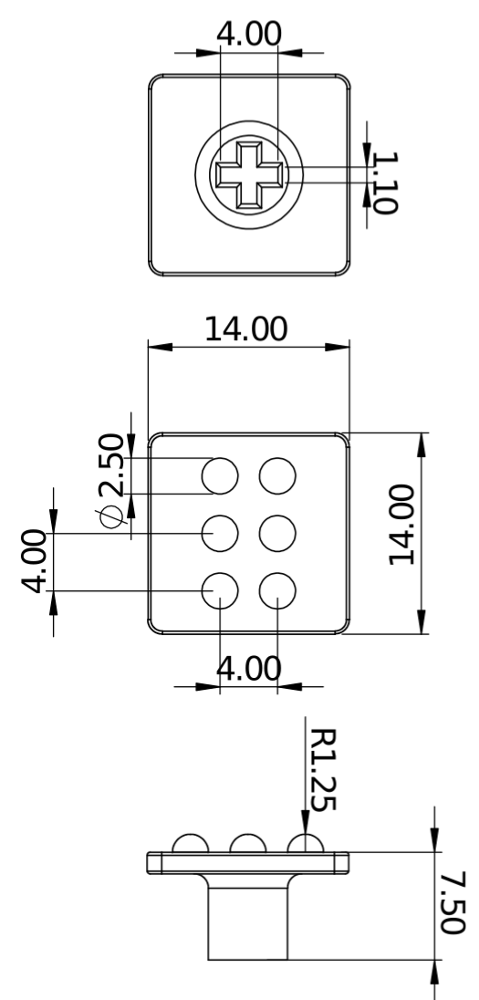

# Guide for recreating experiments and using this benchmarking platform.

These experiments have been created and tested using Ubuntu 16.04 with python>=3.6, support for alternative systems is not currently provided.

### Running Experiments in Simulation ###

It is reccomended that you run experiments in simulation before setting up any physical experiments, this will ensure that algorithm logic works.

#### Setting up  ####
```
# requires python>=3.6
# It is reccomended that you use a virtual environment for this set up

# clone and install the repo (this may take a while)
git clone https://github.com/ac-93/braille_rl.git
cd braille_rl
pip install -e .

# install Spinningup from openAI
git clone https://github.com/openai/spinningup.git
cd spinningup
pip install -e .

# install common robot interface
git clone https://github.com/jlloyd237/cri.git
cd cri
python setup.py install

# install video stream processor
git clone https://github.com/jlloyd237/vsp.git
cd vsp
python setup.py install

# install python3-v4l2capture
git clone https://github.com/atareao/python3-v4l2capture.git
cd python3-v4l2capture
python setup.py install

# install some additional packages
pip install -r requirements.txt

# test the installation by running a training script in simulation, from the base directory run
python algos/dd_dqn_algo/train_discrete_model.py

```
#### Recreating Experiments ####

All experiment parameters are set in the `train_(discrete/cont)_model.py` scripts located in the corresponding algorithm directories. This will save configurations and if specified trained models to the specified `saved_models` directory. An example configuration for each of the possible environments and algorithm combinations for seed 1 is given in the `saved_models` directory. It is reccomended to use the simulated environment for fast prototyping. These training script examples can be copied and run in any directory.

### Running Experiments on Physical Platform ###

#### Keyboard ####

<div style="text-align:center"> &nbsp;&nbsp;&nbsp;&nbsp;&nbsp;&nbsp;
</div>

The keyboard used for these experiments is the DREVO Excalibur 84 Key Mechanical Keyboard with Cherry MX Black switches ([available here](https://www.drevo.net/product/keyboard/excalibur-cherry-mx)).

The 3d printable keycaps are designed to fit on Cherry MX switches, the Black switches have been used as they offer a relatively stiff switch (requiring 60N for actuation) making the task slightly easier.

We printed the keycaps using a high precision 3d printer (Stratasys Objet260 Connex), this ensures that the features to be interpreted are accurate and consistent.

Ideally, recreating these experiments will use the same keyboard or the same key switches, if these components are unavailble a similar experiment can be created using alternatives but differences should be noted. If using an alternative keyboard be sure that evdev accesses the right keyboard by specifying the correct keyboard name in ```ur5GymEnv.py``` files. Additionally, keys are currently presumed to be spaces 19mm apart for discrete tasks and safety limits are specific to this keyboard. These will also need to be adjusted to match alternative keyboards.

#### Configuring Sensor ####

The tacile sensor used in this work is a modified version of the BRL tactile fingertip (TacTip), for more details on this sensor check [https://www.bristolroboticslab.com/tactile-robotics](https://www.bristolroboticslab.com/tactile-robotics). This sensor uses a standard USB webcam as the source for gathering tactile images. This is reliant on the Video Stream Proccessor (VSP) library created by co-author John LLoyd, check the [Github repo](https://github.com/jlloyd237/vsp) for more detail.

If recreating this work with alternative tacile sensors the files that will need to be modified are `envs/robot/cont_ur5_braille_env/ur5_w_tactip.py` and `envs/robot/disc_ur5_braille_env/ur5_w_tactip.py`. These files will need to be modified such that the `get_observation()` function returns a current observation from your specific tactile sensor. If you are using an optical tactile sensor where the images are used as an observation then the VSP library should work as long as the correct device_path is set in the previously mentioned files.  (**Note:** *USB cameras use frame buffers of fixed size, ensure that enough frames are proccessed to cycle this buffer on each iteration such that the observation is from the current time step and not lagging behind.*) To allow for more experimentation the image processing is applied later in the algorithms sections. The `algos\rl_utils.py` file contains a `process_image_observation()` function where cropping, resizing, thresholding, shifting, etc can be applied to the raw images gathered from the sensor.

#### Configuring Robot Arm ####

In this work the control of a the robot arm levarages the Common Robot Interface (CRI) framework developed by co-author John Lloyd, check the [Github repo](https://github.com/jlloyd237/cri) for more detail. This allows for common robotic arm utilities to be used across several different robot arms. The arms currently supported are ABB robot controllers, and UR controllers that implement the Real-Time Data Exchange (RTDE) protocol. Some additional support is provided for the DoBot Magician [here](https://github.com/meisben/cri_dobo), however this arm has less functionality so not all features are supported. The functionality that we use in this project consists of relatively simple tasks such as setting up workspaces and linear moves, unsupported robot arms can be used for this project but control code will have to be re-implemented by the user. Ideally, this framework will grow and offer support for simple functionality across a broad range of robot arms. A useful robot-jogher tool is also provided with the CRI framework, this allows you to specify robot arm settings and find relative positions in joint or world coordinates. 

<div style="text-align:center"></div>

When configuring the robot arm we us mm and degree units throughout. Depending on the tasks, two files will need to be edited for different robotic arm and sensor setups. These are `envs/robot/disc_ur5_braille_env/ur5_w_tactip.py` for the discrete action tasks and `envs/robot/cont_ur5_braille_env/ur5_w_tactip.py` for the continuous action tasks. In both cases 

```
self.robot_tcp  = [x, y, z, alpha, beta, gamma] # tool center point
self.base_frame = [x, y, z, alpha, beta, gamma] # origin of arm base
self.home_pose  = [x, y, z, alpha, beta, gamma] # safe position of arm
```
needs to be spedicified. An optional `self.sensor_angle = theta` can be used to orientate the sensor.

Depending on both the task and the action space different origin points for the work frames needs to be set up differently, in all cases `self.work_frame  = [x, y, z, alpha, beta, gamma]` but these value are chosen according to:

| Task                               | Description                                           |
| ---------------------------------- | ----------------------------------------------------- |
| `Disc-Arrows` &nbsp;&nbsp;&nbsp;   |  3.5mm above center of DOWN arrow                     |
| `Disc-Alpha`  &nbsp;&nbsp;&nbsp;   |  3.5mm above center of Q Button                       |
| `Cont-Arrows` &nbsp;&nbsp;&nbsp;   |  3.5mm above center of box covering all arrow keys    |
| `Cont-Alpha`  &nbsp;&nbsp;&nbsp;   |  3.5mm above center of box covering all alphabet keys |

The robot-jogger tool is useful for finding these work frame positions. Additionally 'tap_move' and 'press_move' can also be adjusted slightly to better suit the specific setup. In the discrete setting be sure to check that each movement gathers a tactile observation without activating a button and in the continuous setting allow for a range of actions that do not activate the button.

### Evaluating Trained Models ###

### Comparing to Current Work ###


